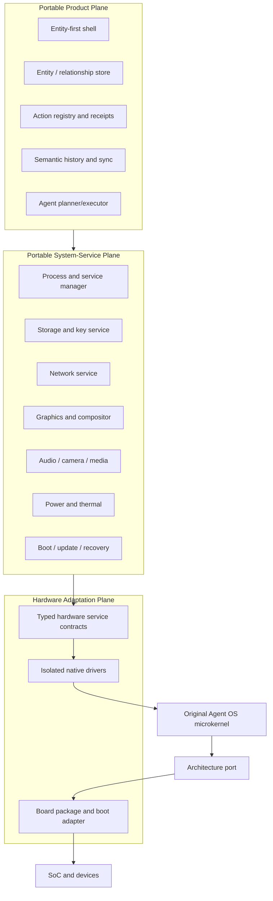

# Portable System Architecture

> The normative layered architecture, portability boundaries, dependency rules, degradation model, and future-device readiness.

## Table of Contents

- [Architecture Overview](#architecture-overview)
- [Portable Boundaries](#portable-boundaries)
- [Layer Model](#layer-model)
- [Contract-First Rule](#contract-first-rule)
- [Dependency Rules](#dependency-rules)
- [Capability and Quality Degradation](#degradation-model)
- [Custom Device Readiness](#custom-device-readiness)
- [Acceptance Evidence](#acceptance-evidence)
- [Planning Reference Anchors](#planning-reference-anchors)

## Architecture Overview

Agent OS is organized as a narrow original microkernel, isolated user-space drivers and services, and a portable product/runtime plane. The architecture deliberately separates **mechanism**, **hardware adaptation**, **system policy**, and **user product semantics**.

The kernel contract is owned by [AOS-ARCH-002](AOS-ARCH-002.md#kernel-scope); hardware adaptation is owned by [AOS-ARCH-006](AOS-ARCH-006.md#driver-model).

## Portable Boundaries

The architecture has three portability boundaries:

1. **Kernel architecture boundary.** Architecture-specific code implements context switching, traps, interrupt-controller access, page-table operations, timers, atomics, and boot entry for x86_64, AArch64, or RISC-V64.
2. **Board and hardware-service boundary.** Board packages declare resources and bind native user-space drivers to versioned device-class services such as display, camera capture, audio, modem transport, storage, and power.
3. **System/product service boundary.** Product code consumes transport-neutral generated clients for stable system services and never addresses a PCI function, MMIO range, Linux device node, Android HAL, vendor ioctl, or Pixel protocol.

A port is valid only when device-specific knowledge is confined below the relevant boundary and the common conformance suite passes unchanged.

## Layer Model

| Layer | Owns | Must not own |
| --- | --- | --- |
| L0 Architecture/boot | CPU entry, traps, MMU primitives, interrupt/timer substrate | Product policy, filesystems, UI |
| L1 Microkernel | threads, address spaces, capabilities, IPC, scheduling, interrupts, time, minimal debug/evidence hooks | device policy, network stack, package manager |
| L2 Driver domains | MMIO/DMA/IRQ access for specific devices | ambient access to unrelated hardware |
| L3 System services | process lifecycle, storage, networking, graphics, media, security, update, power | product-specific entity or agent semantics |
| L4 Product runtime | entities, actions, history, sync, agents, integrations | hardware-specific API types |
| L5 Experience layer | shell, surfaces, stock experiences, accessibility | direct kernel or device access |

## Contract-First Rule

Before implementing a device backend, define:

- semantic operations and state machine;
- capability requirements;
- versioned request, event, and error schemas;
- cancellation and timeout behavior;
- resource and power ownership;
- observability fields;
- mock and trace-replay behavior;
- conformance tests.

The IDL rules are in [the IDL specification](AOS-ARCH-005.md#idl-rules). A backend that exposes only a vendor-specific primitive may exist as an internal driver interface, but the public service contract must remain device-class oriented.

## Dependency Rules

- Higher layers depend on interfaces and generated clients, not implementations.
- Implementations register through manifests and capability routes; they are never discovered through mutable global registries.
- Platform-independent crates must compile for a host test target without kernel or board headers.
- Pixel adapters may depend on observation artifacts or temporary legacy components, but portable layers may not depend on Pixel adapters.
- Hardware-independent tests must run without proprietary firmware.
- Service APIs must not encode an implementation language ABI.

## Capability and Quality Degradation

A board publishes a signed capability and quality profile. Missing functionality is explicit: for example, `camera.capture.raw.v1` may be present while `camera.video.hdr10.v1` is absent. Product surfaces select compatible actions and explain limitations. They must not infer a feature from device identity.

Quality profiles distinguish correctness from quality. A camera backend can conform to capture semantics while declaring a lower tuning tier. A modem backend can support data and SMS without claiming IMS voice. This prevents “feature present” from becoming an unbounded quality promise.

## Custom Device Readiness

The same architecture must support a future contract-manufactured device without redesigning the product plane. Required early provisions are board manifests, manufacturing-test services, secure provisioning APIs, device identity and certificate lifecycle, factory diagnostics, update partitions, calibration storage, and regulatory evidence identifiers. These are specified in [the ODM-readiness document](AOS-HW-008.md#architecture-readiness).

## Acceptance Evidence

The architecture is demonstrated when:

- the same product-core tests run on host, QEMU, and at least two unrelated native boards;
- a hardware service has mock, trace-replay, and native implementations passing one conformance suite;
- a static dependency check proves no Pixel, Android, Linux, POSIX, or vendor HAL type crosses the portable boundary;
- a user-space driver fault is contained and its service restarts or degrades without kernel failure;
- a board capability profile correctly changes available product actions.

## Planning Reference Anchors

These fine-grained anchors give the execution plan stable links into this specification. They are normative pointers: the linked canonical section remains the full requirement source.

### Native Contract

For planning, conformance, and task cross-references, **Native Contract** denotes the part of this specification governed primarily by [Contract-First Rule](#contract-first-rule). Implementations using this label MUST apply the requirements, failure behavior, evidence obligations, and portability or security boundaries of that section together with any narrower task acceptance criteria.

### Portability Boundaries

For planning, conformance, and task cross-references, **Portability Boundaries** denotes the part of this specification governed primarily by [Portable Boundaries](#portable-boundaries). Implementations using this label MUST apply the requirements, failure behavior, evidence obligations, and portability or security boundaries of that section together with any narrower task acceptance criteria.

### Portability Test

For planning, conformance, and task cross-references, **Portability Test** denotes the part of this specification governed primarily by [Acceptance Evidence](#acceptance-evidence). Implementations using this label MUST apply the requirements, failure behavior, evidence obligations, and portability or security boundaries of that section together with any narrower task acceptance criteria.

## Generated Cross-Reference Anchors

### System Boundary

This stable anchor is referenced by another canonical document. Its normative content is the nearest applicable section above and the linked task/claim data; future editorial refinement must preserve the anchor.
