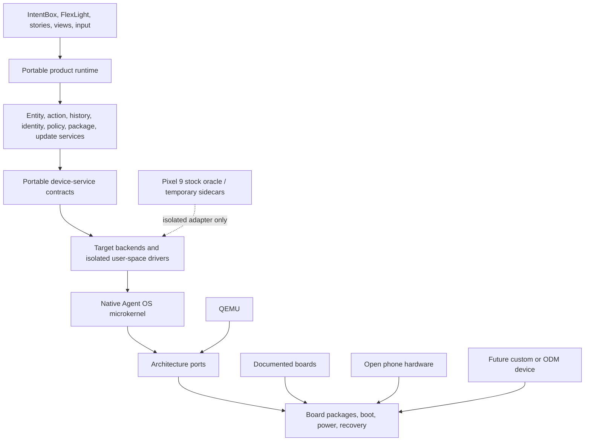

# Executive Briefing

> Decision-oriented summary of the product thesis, owned microkernel, portable layers, hardware routes, legal controls, first actions, purchases, budget, and evidence gates.

## Table of Contents

- [Executive Decision](#executive-decision)
- [Product and Architecture](#product-and-architecture)
- [Hardware Routes](#hardware-routes)
- [Research and Legal Controls](#research-and-legal)
- [First 30 and 90 Days](#first-actions)
- [Initial Purchases and Budget](#budget)
- [Programme Structure](#programme-structure)
- [Primary Gates](#primary-gates)

## Executive Decision

Proceed as an **independently implemented, portable operating system** centered on a Rust-first microkernel and native capability-oriented contracts. Do not redefine the project as an Android distribution, Linux phone, Fuchsia fork, or Pixel-specific custom ROM.

Use Android/Linux only inside the Pixel 9 evidence programme and only to the minimum extent required for stock-baseline measurement, lawful trace collection, recovery, firmware acquisition where permitted, and temporary subsystem bridges. Every bridge has an isolated compatibility cell, source-taint class, owner, native replacement, and last acceptable milestone.

The product hypothesis is an entity- and action-first personal system with semantic history, malleable surfaces, local-first data authority, inspectable agent plans, capability-bounded providers, execution receipts, and reversible or compensating effects. The source-derived product model is summarized in [the product vision digest](AOS-SRC-N001.md#thesis) and normalized in [the product surface tiers](AOS-PROD-012.md#tier-zero).

## Product and Architecture

Kernel policy remains minimal: isolation, objects, capabilities, IPC, scheduling, memory enforcement, interrupts, time, and architecture mechanisms. Drivers, compatibility, filesystems, networking, graphics, product semantics, and agents remain in user space. See [kernel scope](AOS-ARCH-002.md#kernel-scope) and [device-service contracts](AOS-ARCH-020.md#contract-set).

## Hardware Routes

The programme runs complementary routes rather than searching for one perfect first device:

| Route | Purpose | Main compromise | Removal strategy |
| --- | --- | --- | --- |
| QEMU x86-64/AArch64 | deterministic kernel and contract evidence | no physical power, DMA, camera, RF, or timing | physical backends and trace comparison |
| Documentation-first boards | clean native ports, drivers, recovery, portability | board form factor and lower consumer quality | second SoC family, carrier board, quality backends |
| Camera-capable documented platforms | RAW, ISP control, calibration, portable pipeline | not flagship phone integration | Pixel oracle, better modules, tuning partners |
| Open phone-form hardware | display/touch/audio/power/modem integration | weaker camera, performance, industrial design | semi-open target, custom carrier, ODM route |
| Pixel 9 | flagship quality ceiling and hard native feasibility | undocumented/vendor subsystems and legal/access risk | strict experiments, partner access, stop criteria, native replacements |
| Semi-open quality phones | bridge between openness and consumer integration | incomplete native documentation | vendor engagement and replaceable service backends |
| Future custom/ODM device | controlled production quality and lifecycle | NRE, MOQ, contracts, certification | architecture readiness, rights, staged RFI and partner scorecard |

Candidate scoring and compromise-removal rules are in [the hardware catalog](AOS-HW-011.md#candidates) and [the compromise ledger](AOS-HW-013.md#ledger).

## Research and Legal Controls

The source corpus, public prior art, runtime observations, NDA material, legal advice, and independent implementation are separate evidence classes. No assumption becomes a requirement merely because it appeared in a historical spec or another operating system.

Required controls include clean-room role separation, jurisdiction-specific reverse-engineering advice, anti-circumvention analysis, artifact redistribution rights, open-source provenance, trademark clearance, privacy impact assessment, product cybersecurity/update obligations, security disclosure, vendor NDA review, and future certification planning. See [clean-room roles](AOS-LEGAL-002.md#roles), [jurisdiction matrix](AOS-LEGAL-008.md#matrix), and [contract red flags](AOS-LEGAL-007.md#red-flags).

## First 30 and 90 Days

**Days 0–30:** freeze and checksum sources; accept architecture ADRs; create private repositories and CI; establish counsel and trademark work; validate task/spec/source links; acquire safe debug and power equipment; verify board and Pixel SKUs before purchase; complete QEMU bootstrap design; select two documentation-first SoC families.

**Days 31–90:** repeatable QEMU boot and first isolated user process; capability and IPC executable models; native IDL and device-service contracts; first physical-board recovery/diagnostic work; Pixel stock oracle and legally bounded experiment plan; camera reference bench; entity/action/history/receipt vertical schema; public/restricted evidence split; initial adviser and vendor outreach.

The operational sequence is [the First 90 Days plan](AOS-PLAN-007.md#day-zero) and the purchase ordering is [First Purchases](AOS-PLAN-013.md#first-30).

## Initial Purchases and Budget

The current procurement register contains gated, non-payroll estimates:

- **Wave 0 / first 90 days:** approximately **USD 28,940–79,080**.
- **Wave 1 / initial target expansion:** approximately **USD 6,600–12,700**.
- **Wave 2 / quality, cellular, and laboratory expansion:** approximately **USD 9,000–30,300**.
- **Total listed programme equipment and initial professional-services envelope:** approximately **USD 44,540–122,080** before payroll, tax, customs, ongoing cloud usage, large NRE, production tooling, and certification.

These are planning ranges, not quotes. Purchases are blocked until SKU, documentation, recovery, region, license, return, and unique-evidence checks pass. The canonical line items are `docs/hardware/procurement.csv` and [the procurement specification](AOS-HW-009.md#purchase-waves).

## Programme Structure

The documentation is organized into ten thematic volumes while implementation is organized into Phase 0–8. The canonical task graph contains detailed descriptions, acceptance criteria, dependencies, owners, dates, milestones, phase/volume mappings, source/claim/experiment references, and specialist-review flags.

Use [the phase table](AOS-PLAN-010.md#phase-table), [the volume table](AOS-PLAN-011.md#volumes), and [the task catalog](AOS-TASKS.md#catalog-rules) together.

## Primary Gates

- **Architecture gate:** no Android/Linux/vendor types above approved adapters.
- **Portability gate:** the same contract tests pass on QEMU and two unrelated native SoC families.
- **Pixel gate:** continue only with lawful diagnostics, bounded cost, viable power/display/storage path, and explicit replacement strategy.
- **Camera gate:** measurable RAW/metadata/control/calibration path before claims of good quality.
- **Phone gate:** data, SMS, voice, IMS, emergency, carrier, power, and certification remain separate claims.
- **Security gate:** update/recovery, key classes, driver/DMA confinement, provider authority, and agent action safety have scoped assurance evidence.
- **Publication gate:** no broken links, invalid task graph, unsupported claims, restricted-source leaks, or misleading completion language.

Failed hardware experiments may close a route without invalidating the portable architecture. A route is stopped when continued reverse engineering is less defensible than documented hardware, vendor access, a custom carrier, or a future partner device.
