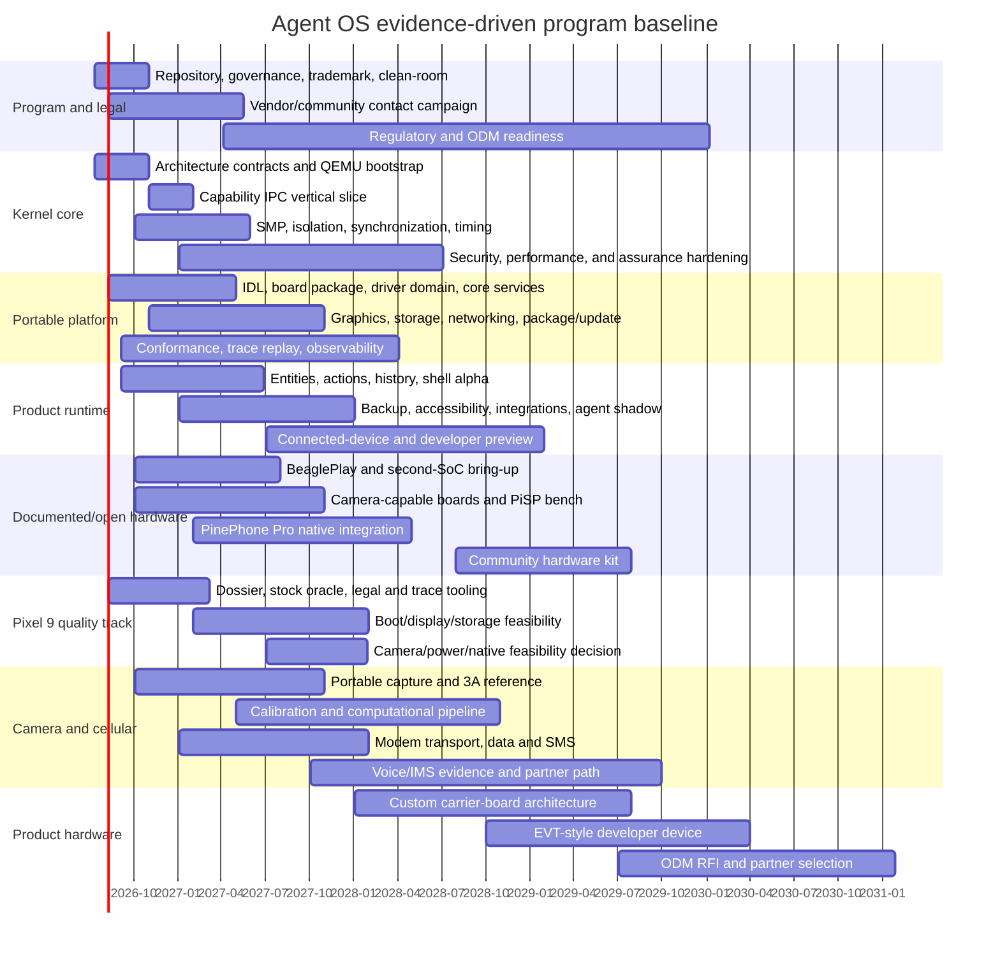

# Roadmap and Gantt Baseline

> A multi-year, parallel, evidence-gated roadmap with Mermaid Gantt and milestone exit evidence.

## Table of Contents

- [Planning Baseline](#planning-baseline)
- [Program Gantt](#gantt)
- [Milestone Baseline](#milestones)
- [Critical Dependencies](#critical-dependencies)
- [Schedule Policy](#schedule-policy)

## Planning Baseline

The baseline starts **2026-07-13** and uses dependency-driven ranges rather than promised shipment dates. The authoritative issue data is [the canonical task CSV](AOS-PLAN-009.md#canonical-schema); this document provides the executive view. Dates must be re-baselined after the first 90-day evidence review.

## Program Gantt

## Milestone Baseline

| Milestone | Target | Exit evidence |
| --- | --- | --- |
| M0 Program ready | 2026-08-07 | repositories, governance, assets, source/claim/task registers validated |
| M1 QEMU boots user space | 2026-10-30 | repeatable CI boot, console, memory protection, crash evidence |
| M2 Capability IPC vertical slice | 2027-01-29 | capability transfer/revocation, driver domain, storage/UI demo |
| M3 Documented-board first frame | 2027-04-30 | native AArch64 boot, storage/network, display frame, recovery |
| M4 Product shell alpha | 2027-06-25 | entities/actions/history/receipts on QEMU and one board |
| M5 Camera reference pipeline | 2027-10-29 | RAW capture, 3A baseline, calibrated image-quality evidence |
| M6 Open-phone data prototype | 2028-01-28 | display/touch/audio/power plus cellular data/SMS evidence |
| M7 Pixel feasibility decision | 2028-01-28 | written continue/limit/stop decision across boot/display/power/camera risks |
| M8 Developer-device preview | 2028-07-28 | recovery/update, daily interaction, published limitations, community kit plan |
| M9 Quality-device route decision | 2029-01-26 | semi-open/custom/Pixel path selected with cost and legal dossier |
| M10 Community hardware kit | 2029-07-27 | reproducible kit, docs, tests, maintainer coverage |
| M11 ODM RFI | 2030-01-25 | requirements, IP clauses, certification responsibilities, shortlisted partners |

## Critical Dependencies

- M2 depends on stable capability-object and IDL semantics, not on a physical phone.
- M3 depends on debug/recovery and board documentation, not camera or cellular.
- M4 depends on storage, graphics, identity, package, and receipt contracts.
- M5 depends on measurable RAW access, calibration assets, controlled scenes, and repeatable pipelines.
- M6 does not imply native carrier voice; cellular data/SMS and voice/IMS are separate gates.
- M7 is a decision milestone, not a promise to complete Pixel 9 support.
- M11 begins only after portable board contracts and manufacturing test interfaces are stable.

## Schedule Policy

A milestone moves when a dependency changes or evidence disproves the estimate. It never remains nominally “green” by reducing acceptance criteria. The task CSV stores start week, duration, target date, dependencies, risks, and evidence so Linear, GitHub, or another planner can render alternative scenarios.

## Generated Cross-Reference Anchors

### Programme Gantt

This stable anchor is referenced by another canonical document. Its normative content is the nearest applicable section above and the linked task/claim data; future editorial refinement must preserve the anchor.
