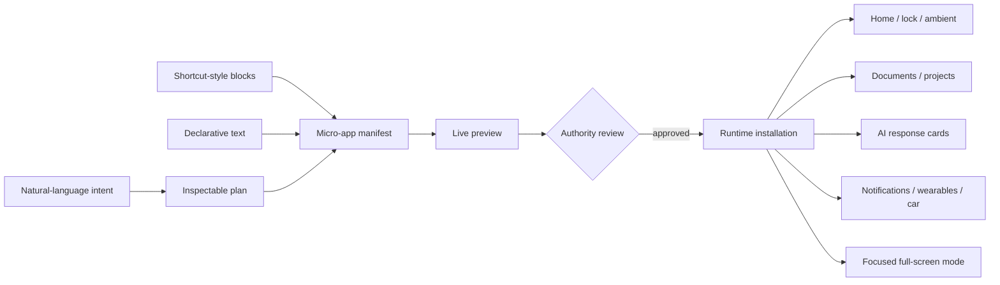

# Text-to-Micro-App and Widget Builder

## Product definition

A micro-app is a small, inspectable composition of data queries, typed actions, state, layout and policy. It is not a miniature monolithic application and is not limited to a home-screen rectangle.

Users may describe a micro-app in natural language, assemble it visually like a workflow, edit its declarative source, or accept a contextual proposal from an agent. All four paths produce the same versioned manifest and preview.

Example request:

> Show today’s UV index, explain the risk for my skin profile, notify me before it becomes high, and put sunscreen and outdoor-time actions next to it.

Agent OS resolves weather and health providers, proposes data use and actions, produces a preview, asks for missing authority, and installs one micro-app that can render wherever context requires it.

## Surfaces

The same micro-app may render as:

- an interactive card inside an AI or chat response;
- a live block inside a document, project or task;
- a home, lock-screen or ambient widget;
- a notification with structured actions;
- a command-palette or IntentBox result;
- a full-screen instant mode;
- a sidebar, table cell, timeline item, map overlay or story;
- a watch, e-ink, vehicle or external-display view;
- a shareable card or embedded portal surface;
- a CLI/TUI view generated from the same action and schema contracts.

A surface is a view of the micro-app entity. Moving it between surfaces does not create disconnected copies.

## Builder model



### Primitive blocks

- **Input:** entity, selection, text, voice, camera, location, sensor, schedule, webhook, mesh envelope.
- **Query:** provider data, local graph, calculation, filter, group, sort, join and aggregate.
- **Transform:** template, unit conversion, threshold, classification, summarisation and chart series.
- **View:** text, metric, chart, table, map, image, form, checklist, timeline, media or custom declared component.
- **Action:** typed local/system/external operation with confirmation and receipt policy.
- **Trigger:** tap, schedule, threshold, entity change, nearby peer, incoming message, location, hardware event or agent proposal.
- **State:** local value, durable entity field, ephemeral UI state or shared CRDT state.
- **Policy:** capability, data class, destination, cost, battery, network, expiry, audience and retention.

## Declarative example

```yaml
micro_app:
  id: user.uv-day
  title: UV today
  inputs:
    place: current-place
    skin_profile: private.health.sun-profile
  query:
    provider: weather.uv
    fields: [current, hourly, max, updated_at]
  views:
    compact: metric + risk-label
    card: hourly-chart + recommendation + actions
    ambient: max + safe-until
  actions:
    - reminder.create(sunscreen, before: high)
    - calendar.find_outdoor_events(today)
    - route.open(shade_preferred: true)
  policy:
    skin_profile: local-only
    weather: network-allowed
    actions: preview-before-write
```

## Required interaction rules

1. Every generated micro-app opens in preview before installation or external effect.
2. Data sources, provider identity, update time, requested capabilities and destinations are visible.
3. The user can switch between natural language, visual blocks and declarative source without losing semantics.
4. An agent may propose changes but cannot silently broaden authority, data access, spend, network use or audience.
5. Each external action produces a receipt and an undo or compensation path where possible.
6. A micro-app degrades into a valid read-only or stale-data state rather than disappearing when a provider is unavailable.
7. Accessibility semantics and keyboard/voice navigation are generated from the same component schema and must be reviewable.
8. Installation is content-addressed, signed, versioned and reproducible; provider changes cannot silently alter declared behavior.

## Representative use cases

### Everyday and health

- UV index with personal threshold, safe-until time and sunscreen reminder.
- Pollen/air-quality card tied to medication and route suggestions.
- Medication schedule with remaining supply, refill action and travel-time-zone handling.
- Hydration or recovery view using local wearable data without uploading the raw stream.
- Pet medication, feeding and symptom log embedded in the pet entity.

### Work and projects

- “What changed overnight?” project card combining tasks, commits, messages and blocked decisions.
- Meeting brief with attendees, open promises, documents and actions to create follow-ups.
- CI/release card inside a developer conversation with logs, rerun and rollback actions.
- Procurement comparison that watches availability and opens the evidence behind each score.
- A compact approval form embedded directly in a specification or agent answer.

### Mobility and environment

- “Leave now” commute micro-app using calendar, weather, traffic, battery and preferred transport.
- Parking session card with remaining time, location, payment and return route.
- Energy card combining home tariff, solar output, battery and controllable loads.
- Camera exposure assistant with sensor metadata, light reading, lens profile and safe setting actions.
- Off-grid Agent Mesh inbox showing pending, relayed and delivered bundles.

### Communication and media

- Person card that selects a route by recipient, urgency, privacy and availability rather than by messaging brand.
- Live translation card in a conversation with source, confidence and “send corrected version” action.
- Parcel or travel disruption card with evidence, alternatives, refund and share actions.
- Interactive poll, calculator, configurator or chart generated inside an AI response.
- Shared event card that becomes a task list, map, ticket wallet and group message surface without opening four apps.

## Distribution and sharing

A micro-app may be private, shared with named people/projects, published as source, distributed through a signed provider registry, or instantiated temporarily from an AI response. Sharing transfers manifest, dependencies, declared policy and test fixtures — never the user’s secrets or private bound data.

A recipient sees an authority diff before activation. Missing providers become explicit substitutions, not silent behavior changes.

## Business and ecosystem boundary

Providers may charge for data, actions, compute, premium components, support or certification. Discovery is contextual and user-controlled. Ranking, sponsorship and payment must be visible. No vendor may require an opaque monolithic app merely to expose one capability.

## Acceptance evidence

- text, block and source editors round-trip without semantic drift;
- one micro-app renders conformantly on at least five surface classes;
- malicious manifests cannot exceed declared capabilities, CPU, memory, network, storage or rendering budgets;
- provider loss, stale data, offline use, upgrade, rollback and sharing are tested;
- generated accessibility tree and action confirmations pass independent review;
- at least twenty representative micro-apps are reproduced from source and conformance fixtures.

## Related documents

- [Actions, integrations and widgets](AOS-PROD-003.md)
- [Malleable itemized software](AOS-PROD-008.md)
- [Action provider interoperability](AOS-PROD-011.md)
- [Micro-app runtime](../architecture/ARCH-026-micro-app-runtime.md)
- [Agent runtime and action safety](../architecture/AOS-ARCH-010.md)
- [Personal data authority](AOS-PROD-009.md)
